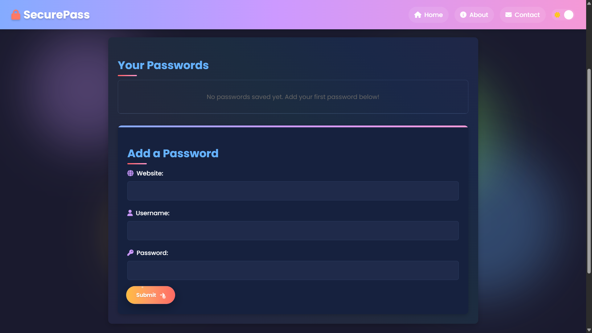
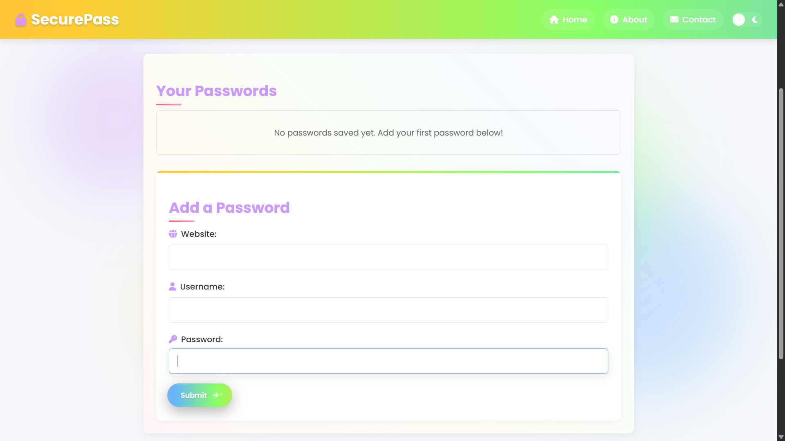

# 🔒 SecurePass - Password Manager

## Overview

**SecurePass** is a modern, visually stunning password manager web app built with vanilla HTML, CSS, and JavaScript. It allows you to securely store, view, and manage your passwords for different websites—all in your browser, with no backend required. Your data is stored locally using your browser's `localStorage`.

---

## Features

- 🌈 **Beautiful Rainbow UI**: Eye-catching gradients, animated backgrounds, and confetti effects.
- 🌙 **Light & Dark Mode**: Toggle between light and dark themes with a single click.
- 🔒 **Password Storage**: Add, view (masked/unmasked), copy, and delete passwords for any website.
- 🖱️ **Copy to Clipboard**: Instantly copy website, username, or password with a click.
- 🎉 **Confetti & Animations**: Enjoy magical confetti and button effects on successful actions.
- 📱 **Responsive Design**: Fully mobile-friendly with a hamburger menu and adaptive layouts.
- 💾 **LocalStorage**: All passwords are stored securely in your browser—no server, no cloud, your data stays with you.

---

## How to Use

1. **Clone or Download** this repository.
2. Open `index.html` in your favorite browser.
3. Add your website, username, and password in the form and click **Submit**.
4. Your passwords will appear in the table below. Use the copy icons to copy details, the eye icon to show/hide passwords, and the delete button to remove entries.
5. Toggle between light and dark mode using the sun/moon icon in the navigation bar.

> **Note:** All data is stored in your browser's localStorage. Clearing browser data will remove your saved passwords.

---

## Customization

- **Colors & Styles**: Edit `style.css` to change the rainbow palette, animations, or layout.
- **Logo**: Replace `favicon.svg` with your own SVG for a custom logo.
- **Functionality**: Modify `script.js` to add features like password generation, export/import, or cloud sync.

---

## Technologies Used

- **HTML5**: Semantic structure and forms
- **CSS3**: Custom properties, gradients, animations, responsive design
- **JavaScript (ES6+)**: DOM manipulation, localStorage, event handling, clipboard API
- **Font Awesome**: Iconography (via CDN)

---

## Screenshots

### Dark-Mode

---

### Light-Mode

---

## License

This project is open source and free to use for personal and educational purposes. 